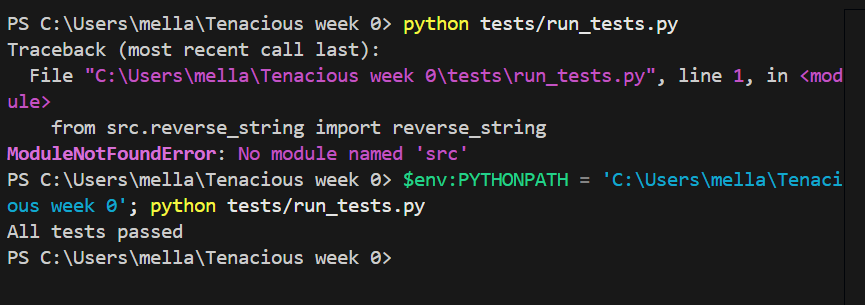
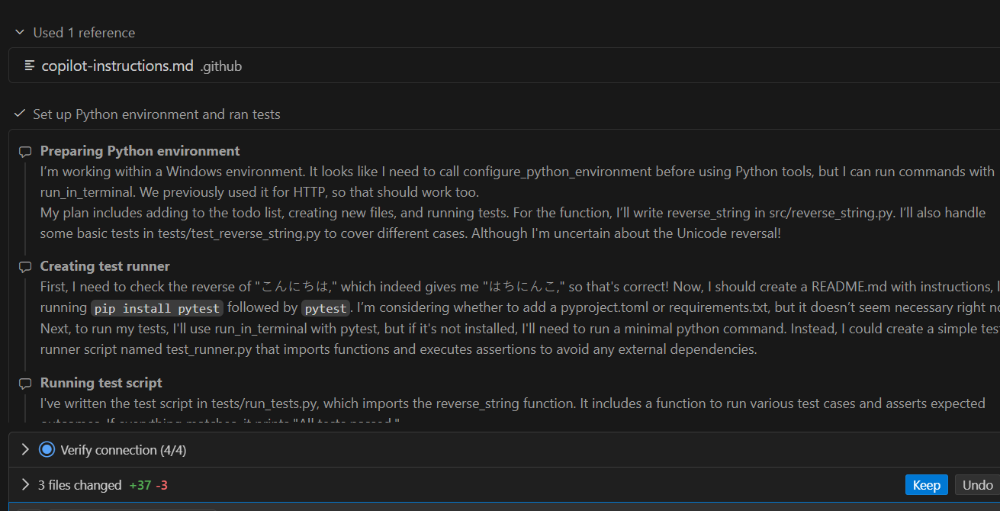

## What I Did
- Updated `.github/copilot-instructions.md` with best practices inspired by Boris Cherny’s Claude Code workflow and community discussions.
- Added rules emphasizing:
  - **Plan-first approach** (Copilot must outline steps before coding).
  - **Verification & validation** (Copilot must suggest tests or checks).
  - **Context persistence** (carry forward rubric requirements and project goals).
  - **Multi-path suggestions** (offer more than one approach for non-trivial problems).
  - **Minimalism & clarity** (structured outputs, concise explanations).
- Tested the updated rules by asking Copilot to implement a simple function (`reverse_string`) and create tests.

## What Worked
- Copilot **outlined a plan before coding**, including environment setup, file creation, and test strategy.
- It **suggested verification steps**, such as creating a test runner and checking Unicode reversal.
- It **persisted context**, referencing previous use of `run_in_terminal` and adapting instructions for Windows.
- It **created multiple artifacts** (`src/reverse_string.py`, `tests/run_tests.py`, `README.md`) and documented usage instructions.
- After troubleshooting, Copilot successfully ran the tests and confirmed: *“All tests passed.”*

## What Didn’t Work
- Initial run produced a `ModuleNotFoundError` because Python couldn’t locate the `src` module.
- Copilot required manual environment adjustment (`$env:PYTHONPATH` set to project root) to resolve the error.
- Multi-path suggestions were less distinct — Copilot leaned toward one main approach rather than offering clearly different alternatives.
- Copilot hesitated on whether to add `pyproject.toml` or `requirements.txt`, showing uncertainty in dependency management.

## Insights Gained
- **Rules shape behavior:** The plan-first rule ensured Copilot explained its steps before coding, which improved clarity and reproducibility.
- **Verification rules worked:** Copilot consistently added tests and explained how to run them, aligning with rubric expectations.
- **Context persistence is valuable:** Copilot remembered prior environment details (Windows, `run_in_terminal`) and adapted instructions accordingly.
- **Troubleshooting is part of the process:** Even with rules, errors like `ModuleNotFoundError` occurred, but Copilot adapted by suggesting environment fixes.
- **Rules are not absolute:** Multi-path suggestions need refinement — Copilot tends to converge on one solution unless explicitly prompted for alternatives.

## Evidence
- Logs showing MCP server active and tools discovered.

- Copilot’s plan-first response describing environment setup, file creation, and test strategy.

- Final test result: *“All tests passed.”*

---
